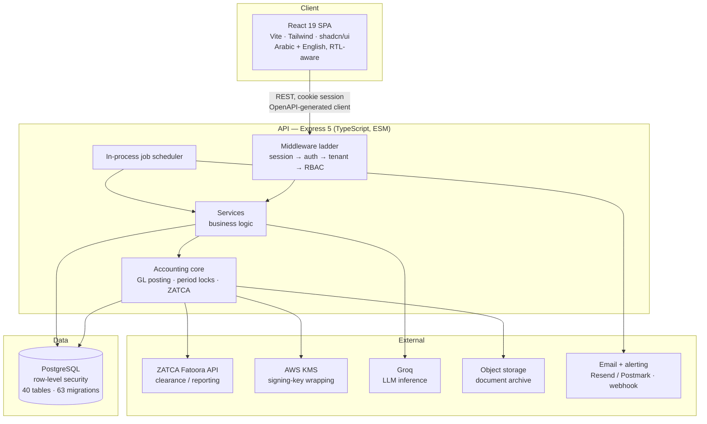
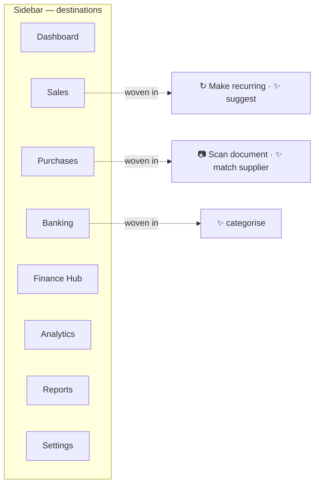
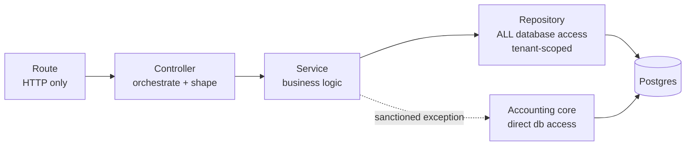
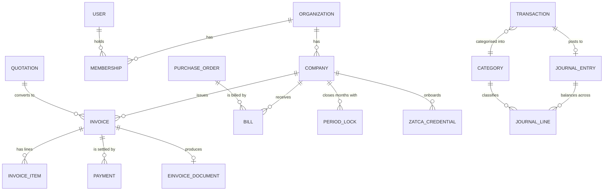
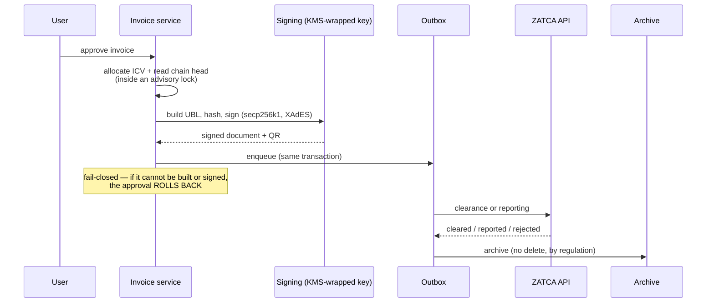
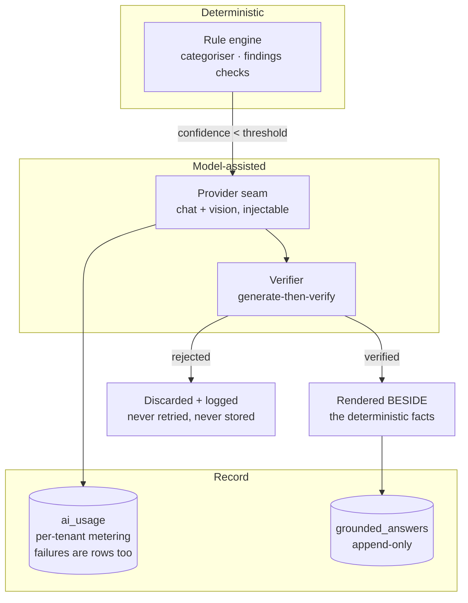

# Saudi Ledger Platform — High-Level Design

**Status (2026-08-27): describes the system as built on this date. Current state authority: [`CLAUDE.md` §2](../CLAUDE.md).**

This document is written for someone who has never seen the codebase — a
technical advisor doing diligence, a prospective partner, or a developer
joining the team. It describes **what exists**. Where something is decided but
not built, it says so explicitly and marks it **PLANNED**.

It deliberately does **not** restate current status, because a second copy of
"where we are" ages silently. For that, read `CLAUDE.md` §2, which is the single
writer for it.

---

## 1. What the product is

An **AI-powered accounting and finance platform for Saudi Arabia**, intended to
extend to the wider GCC. It began as a single-tenant bookkeeping application and
was refactored into a multi-tenant SaaS platform.

The accounting core is real and in use: invoices, bills, journal entries,
double-entry general-ledger posting, period locks, VAT returns, and financial
reporting all work today against real Postgres data.

Three things distinguish it from generic accounting software:

1. **ZATCA Phase 2 e-invoicing** — Saudi Arabia's tax authority requires
   invoices to be cryptographically signed, chained, and cleared or reported
   through its API. This is implemented natively rather than bolted on.
2. **Arabic as a first-class requirement** — both directions of the UI (RTL) and
   Arabic financial text in the AI layer. An English-strong, Arabic-poor
   component fails regardless of its other qualities.
3. **A deliberately constrained AI layer** — the model classifies, explains and
   answers from tools; it never writes to the ledger and never authors a tax
   position.

### What it is not

- It is **not deployed**. See §10.
- It has **no billing mechanism** — no subscriptions, no plans, no payment
  provider. This is tracked as a known gap, not an oversight.
- It has **no customers yet**, which is why schema changes and reversals remain
  cheap and are used freely.

---

## 2. System overview



**Reading the diagram:** every client request enters through the middleware
ladder, which is where tenancy and authorization are established (§5). Business
logic never talks to the database directly — it goes through repositories, with
one sanctioned exception (§4). Background work runs in-process, not on a queue
service.

---

## 3. What a user can actually do, and how it is organised

An outsider reading only the architecture would not learn what the product
*is* from a user's seat. This is the shipped surface as of 2026-08-27 — pages
that exist and are reachable, not a roadmap.

### 3.1 The capability surface

| Area | What exists |
|---|---|
| **Sales** | Customers, products, **quotations**, invoices, credit notes, receivables ageing, customer ledger |
| **Purchases** | Vendors, **purchase orders**, bills, payables ageing |
| **Banking** | Bank accounts, statement upload, an automatic categoriser, a review surface for held rows, bank reconciliation with match *suggestions* |
| **Ledger** | Chart of accounts, journal entries, trial balance, general ledger, account statements |
| **Statements** | Income statement, balance sheet, cash flow, owner's equity — each with prior-period comparison |
| **Tax & compliance** | VAT return (box-structured, filed from documents), tax journal entries, ZATCA onboarding and transmission |
| **Payroll & assets** | Employees, payroll runs, fixed assets and depreciation schedules |
| **Controls** | Draft/approval workflow, **closed months**, audit trail, user management, budgets |
| **Automation** | Recurring documents (**drafts only**), document capture by phone photograph with OCR and QR decoding |
| **Insight** | Finance Hub, Analytics, deterministic **findings** |
| **Operator** | Sign-up review queue, ZATCA operations panel |

Two capabilities are **PLANNED, not built**: the Zakat working paper (the page
currently states it is not implemented, deliberately, rather than showing a
computed-looking zero), and bank feeds.

### 3.2 The information architecture, and why it is shaped that way

Product structure was decided by owner interview
([`hub-structure-decision.md`](product/hub-structure-decision.md), 2026-08-12):
**two destinations, two capabilities woven in.**



Automation and AI have **no navigation entry of their own**, and that is the
design rather than an omission:

- A recurring-invoice rule is a property *of an invoice*. A separate Automation
  section would mean leaving the invoice you are looking at to configure
  something about it.
- An AI suggestion is useful only *at the moment of the decision it informs* —
  beside the category field, not in a gallery elsewhere.
- The intended customer is a small-business owner, not an accountant. Every
  additional navigation entry is something they must learn before the product is
  useful.

**The measure of success is that the user does not think about them.**

### 3.3 One interaction principle worth stating

**Accepting the match *is* the review.** Where the system proposes something —
a reconciliation match, a category — one user action both accepts the proposal
and records its effect. A second confirmation dialog asking about the same fact
is treated as a design defect rather than extra safety.

The counterpart: the system **never auto-applies**, however exact a match is.
Suggestions arrive pre-selected; a human clicks.

## 4. Architecture

### 4.1 Monorepo

pnpm workspaces. `pnpm` is enforced — a preinstall guard rejects npm and yarn.

```
apps/
  api/       Express 5 backend (@workspace/api-server)
  web/       React 19 frontend (@workspace/bookkeeping)
packages/
  db/                Drizzle schema, migrations, connection management
  api-spec/          OpenAPI specification + codegen config
  api-zod/           GENERATED Zod schemas and types
  api-client-react/  GENERATED React Query client
  config/            validated environment (fail-fast at boot)
scripts/
docs/
```

### 4.2 Layered backend

Strictly enforced, and the layering is the thing most likely to be violated by a
newcomer:



- **Routes** validate and delegate. No business logic.
- **Controllers** orchestrate and shape responses. No database access.
- **Services** hold business logic.
- **Repositories** own every query and are tenant-scoped.
- **The accounting core** (`services/accounting/` — GL posting, period locks,
  ZATCA — and `services/categorization/`) is the one sanctioned exception with
  direct database access. It is the oldest, most heavily tested code and is
  extended rather than rewritten.

### 4.3 API contract: OpenAPI-first with codegen

`packages/api-spec/openapi.yaml` is the contract. The workflow is: change the
spec → run codegen → implement. The generated React Query client and Zod
schemas are never hand-edited.

One deliberate exception: `packages/api-client-react/src/custom-fetch.ts` is
hand-maintained, because it carries cookie credentials and a verification-gate
hook that codegen cannot express.

### 4.4 Frontend

React 19 + Vite, Wouter for routing, TanStack Query for data fetching, Tailwind
v4 with shadcn/ui primitives.

**Internationalisation** is a custom `LanguageContext` rather than a library:
Arabic and English, with `document.documentElement.dir` driven by the active
language. Layout uses CSS **logical properties** (`ms-`/`me-`, `text-start`) so
direction actually flips.

> **Known limit (2026-08-27):** the vendored shadcn primitives — dropdowns,
> menus, sheets, sidebar — still use physical properties (120 occurrences across
> 25 files). **RTL is therefore incomplete** in those components. This is a
> recorded decision, not an oversight: rewriting vendored files creates
> permanent drift against upstream, for a component layer due to be redesigned.
> See [`design-pass-inherited-decisions.md`](product/design-pass-inherited-decisions.md).

### 4.5 Background work

An **in-process scheduler** (`apps/api/src/jobs/`), not Redis, not a queue
service. Nine registered jobs: e-invoice transmission, archive sweep,
certificate-renewal reminders, document capture promotion and purge, recurring
document generation, platform alarms, demo reset, and scheduled findings.

Two properties worth knowing:

- A job can be **registered but not scheduled**. That is how e-invoice
  transmission stays a deliberate act behind a flag without that flag silently
  disabling every unrelated job.
- **Registration is not authorization.** Which jobs a platform operator may
  trigger is declared separately in `lib/operatorJobs.ts` and pinned by a test
  that fails when the two lists disagree. This followed an audit finding — see
  §5.6.

---

## 5. Multi-tenancy and the security model

This is the most developed part of the system, and the part most shaped by
repeated adversarial review.

### 5.1 The core mechanism: RLS on a non-owner role

Every business table carries a `NOT NULL organization_id` and a
`tenant_isolation` row-level-security policy keyed on a Postgres session
variable, `app.current_org_id`.

Isolation is not enforced by remembering to write `WHERE organization_id = ...`
in every query. It is enforced by the database:

```mermaid
sequenceDiagram
    participant C as Client
    participant A as requireAuth
    participant T as resolveTenant
    participant P as requirePermission
    participant H as Handler
    participant DB as Postgres

    C->>A: request + session cookie
    A->>A: valid session? else 401
    A->>T: 
    T->>DB: load active memberships (owner connection)
    T->>T: pick active org; VERIFICATION GATE<br/>non-approved org ⇒ 403 here
    T->>DB: BEGIN as non-owner role<br/>SET app.current_org_id / current_company_id
    T->>P: run rest of request inside that transaction
    P->>P: role × resource × action, fail-closed
    P->>H: 
    H->>DB: every query filtered by RLS
    H-->>C: response
    Note over T,DB: COMMIT on success · ROLLBACK on error or abort
```

The per-request transaction runs as a **non-owner role**, so RLS actually
applies (a table owner bypasses it). The transaction commits on a successful
response and rolls back on error or client abort, so tenant context can never
leak across pooled connections.

**The verification gate short-circuits before the transaction opens.** An
organization that has not been approved by a platform operator gets a 403 with
no tenant context ever established — so even a route mounted by mistake finds no
context, matches zero rows, and cannot write.

### 5.2 The identity layer sits outside RLS — deliberately

`organizations`, `users` and `organization_memberships` are **not** RLS-scoped.
They are read before tenancy exists (you cannot scope by organization while
deciding which organization you are in).

The rule that follows: **business-layer code must never read those three
tables.** A forgotten filter there is a silent cross-tenant leak with no
database backstop. Only the identity layer — pre-tenant, on the owner
connection, with explicit authorization — may touch them. A build-time test
enforces the import boundary.

### 5.3 Authorization

Three distinct mechanisms, used for three distinct things:

| Mechanism | Used for | Source of truth |
|---|---|---|
| `requirePermission(resource)` | tenant business routes | seeded role × resource × action matrix; fail-closed |
| explicit admin-of-**this**-org checks | identity-layer routes (members, invitations) | `organization_memberships` |
| `requirePlatformOperator` | the cross-tenant operator surface | `platform_operators` |

A user's authority comes from their **membership role** in the active
organization. The global `users.role` column is vestigial and must never gate
access — it was once self-grantable via public signup, which invalidated every
guard that trusted it.

That incident produced a standing rule: **a privilege that becomes
self-grantable invalidates every guard that trusts it.** When a change makes a
role, flag or capability obtainable by a less-trusted party, every guard reading
it must be re-audited.

### 5.4 The platform-operator boundary

Platform operators review and approve organization sign-ups. They are the only
cross-tenant privileged role.

**The guarantee: operator status grants nothing whatsoever inside a tenant.**
Operators hold no organization membership, so the tenant middleware has nothing
to resolve for them and every business route is closed.

As of 2026-08-27 that guarantee is a **measurement, not a comment**: a test
suite has an operator attempt to add themselves to a tenant as admin, add
others, list and modify members, reach the user-administration surface, invite,
read security events, and call business routes — all refused — with an
anti-vacuity twin proving the same calls succeed for the tenant's own admin.

Structurally, operator status is consulted in exactly **four** places in the
API, none of them an authorization path, and there is **no write path** to the
`platform_operators` table anywhere in the application: it is granted only by
the seed. Operator status is not self-grantable.

### 5.5 What the audits taught

The security posture has been shaped by repeated adversarial review rather than
designed once. Two lessons are worth stating in a design document because they
changed how the system is built, not just what was fixed:

**Enforce invariants at the write boundary, not in one path.** An invariant that
three writers can violate belongs in a database CHECK constraint or a shared
gate, not in per-path code — per-path enforcement is per-path review, and a new
path starts at zero. Several invariants live in migrations for this reason.

**A composition defect is invisible to any review that reads one file at a
time.** This one is structural. There are two shapes:

- *A fact one file writes and another trusts.* Each file is correct in
  isolation; the vulnerability is the edge between them. One such defect
  survived five audits — including two dedicated authorization sweeps — and
  every one of them was right about every file it read. The countermeasure is a
  different question, asked of privileges rather than code: **for each
  privilege, list the state it can write; for each written fact, find every
  guard that reads it.** This stays a human activity.
- *A guard that exempts a class from the thing designed to exclude it* — a route
  on the wrong side of a guard, a business route with no permission check, a
  privilege tier that widens because a mount moved one line. These are
  **positional** facts, and they are now mechanically checked (§5.6).

### 5.6 The privilege surface map

A test derives **what each privilege can reach** from the live Express router
stack — the middleware layers in the order the framework will actually execute
them — and cross-checks that against the mounts declared in source. Either side
drifting fails the build.

```
public           4  /healthz /deployment /auth /invitations
authenticated    2  /orgs /onboarding
operator         1  /operator
tenant          29  /companies /transactions /invoices /reports ...
```

It pins the public surface (anything above the auth guard needs no session at
all, and mount **order** is the only thing deciding that), the operator surface,
the two authenticated routes that run before tenancy and therefore have no RLS
backstop, and the fact that no tenant route is mounted without a guard.

> **What it does not cover, stated so it is not oversold:** it measures
> positions, not data flow. It would not have caught the composition defect
> described above, because every route involved in that defect was correctly
> placed. Two shapes, two countermeasures, and only one of them is mechanical.

### 5.7 Other properties worth knowing

- **Auth** is Express sessions (`express-session` + `connect-pg-simple`, bcrypt),
  not Supabase Auth. Supabase is used as Postgres only.
- **Rate limiting** is backed by a shared Postgres store, so limits hold across
  processes; it fails **closed** if the store errors.
- **Audit trails**: business actions go to `audit_logs` (tenant-scoped);
  identity and security events go to a separate `security_audit_logs`. Several
  tables are append-only at the grant level — the record of when money arrived
  is exactly the row someone would want to quietly fix.
- **Foreign keys are checked outside RLS.** Postgres evaluates FK constraints
  with the table owner's privileges, so a plain FK between tenant-scoped tables
  is a cross-tenant edge no policy guards. Tenant-scoped pre-checks close this.

---

## 6. The data model, conceptually

40 tables, 63 migrations. Rather than enumerate them, here are the clusters and
the rules that govern them.



**Organization → Company.** An organization is the tenant and the unit of
billing and membership. A company is the legal entity that holds the VAT
registration and issues invoices. One organization may hold several companies;
period locks, ZATCA credentials and invoice numbering are **company**-scoped.

**The general ledger is the source of truth for money.** Journal entries and
their lines are the ledger; every other money view derives from them. Documents
(invoices, bills) post to the ledger through one path. Bank transactions, once
accepted, also post — so the dashboard and the profit-and-loss statement cannot
disagree by construction rather than by agreement.

**Invariants that are structural rather than conventional:**

- **Amounts are stored positive**; direction lives in the document type, and
  every consumer applies the sign explicitly. A credit note reverses; a debit
  note does not.
- **Nothing affects the books before approval.** Drafts and submitted records
  move zero in every report, and this is asserted by test for each approvable
  entity.
- **A reversed journal entry is still *in* the books.** The status marks that a
  cancelling mirror exists; it is not an eraser. Filtering aggregations to
  "posted only" double-negates every reversal — a real defect that was found
  live.
- **Transfers and settlements are excluded from income, expense and tax
  aggregates.** The bank balance moved, but nothing was earned or spent.
- **Documents file; transactions reconcile.** The VAT return is computed from
  invoices and bills at line level; the transaction-derived figure is a
  reconciliation view shown beside it, never the filing figure.
- **Period locks are company-scoped**, in both the posting path and the routes.
  A correction to a closed period posts in the current open period; it is never
  re-dated backwards and never silently skipped.

**Fiscal calendars.** Gregorian or **Umm al-Qura Hijri**. Hijri conversion is
done by binary search over the platform's ICU tables — an arithmetic
approximation was tried and is wrong, because Hijri months are tabulated, not
computed. The API refuses to boot on a runtime whose ICU build would silently
substitute Gregorian dates.

---

## 7. ZATCA e-invoicing integration

Saudi Arabia's Phase 2 e-invoicing requires each invoice to be built as UBL XML,
signed with a certificate issued by the tax authority, chained to its
predecessor, carry a TLV-encoded QR code, and be **cleared** (standard invoices,
before issue) or **reported** (simplified invoices, within 24 hours).



**Design decisions that matter:**

- **Issuance fails closed.** If a document cannot be built or signed, the
  approval rolls back. A key-management outage stops invoicing rather than
  minting an invoice with an unrecoverable gap in the counter.
- **Two mechanisms protect the chain**: allocation is serialised by an advisory
  lock covering both the counter read and the chain-head read, and ordering is
  by counter rather than row id. A unique constraint is a backstop that
  structurally cannot detect a fork.
- **The archive cannot delete.** The regulation forbids deletion, so the archive
  interface has no delete method at all — and a test asserts it never gains one.
  Deletable staging is a separate interface.
- **Invoice numbering** is a per-company monotonic counter that never resets;
  the year in `INV-2026-000045` is a display prefix. This was verified against
  the primary legal texts, which require "a sequential number which uniquely
  identifies the Tax Invoice" — sequential and unique, not gapless.

### 🔴 What is proven, and what is not — stated plainly

**Confirmed against the live ZATCA sandbox:** certificate signing requests and
the `secp256k1` curve, the XAdES signature properties, all nine QR tags, six
compliance documents across invoice/credit-note/debit-note in both standard and
simplified flows, and the full path from real Postgres rows to a ZATCA-accepted
document.

**Not verified: an invoice has never been submitted to ZATCA in any
environment.** The compliance pass exercises document *construction* against an
onboarding endpoint. The production clearance and reporting endpoints have never
been called. The transport is proven against a mock; the archive has only been
exercised on local disk.

This is blocked on a **registered Saudi company with an active VAT registration
and tax-authority credentials**, which does not exist yet. It is not a technical
step.

---

## 8. The AI layer

The layer is deliberately constrained, and the constraints are the design.

### 8.1 The governing rules

- **AI proposes; it never posts.** The general ledger is written only through
  the established posting path. Model output is drafts and suggestions a human
  approves.
- **The model SELECTS; it never AUTHORS a tax position.** It may choose among
  classifications the system defines. It does not compose tax reasoning.
- **The deterministic engine stays the brain.** The rules-based categoriser
  decides; the model is consulted as a second opinion only below a confidence
  threshold.
- **One writer per effect.** No debit/credit ever originates from a model.

### 8.2 Architecture



**The verifier is the interesting part, and its contract is honest about what it
can and cannot prove.** For model-written explanations of a finding:

- The **numeric and entity class is proven mechanically** — every number and
  named entity in the generated text must match a real fact from the finding,
  with cross-script matching so Arabic-Indic digits are handled.
- The **qualitative class is only argued** — a second pass must return empty.

Because the second guarantee is weaker, the interface renders the deterministic
facts **beside** the explanation, never instead of it. Rejected text is
discarded and logged, never retried and never stored.

A related rule: **a verification is a claim about a moment, not a property of
the text.** An explanation verified against yesterday's facts becomes false when
the underlying row changes — the words unchanged, the truth gone. So validated
output stores a hash of what it was checked against, and rendering is gated on
the match.

**Grounded answers** (the question-answering surface) work the same way: the
model selects one of a fixed set of tools and never authors a number. Where a
projection is involved, its assumptions are *tool output* and an answer that
uses the numbers without them is rejected — the assumption is not
discouraged-but-skippable, it is unrepresentable.

### 8.3 The data boundary

**No hosted model may see tenant data until a specific commercial agreement
exists.** The constraint ranking is residency > quality > cost.

Enforcement is at **boot**: production refuses to start with the hosted provider
enabled unless a typed attestation environment variable is present. Development
uses the provider's free tier with synthetic and development-organization data
only — and the free tier means requests route globally, so it must not touch any
real tenant's ledger, receipts or documents.

**PLANNED / BLOCKING:** the enterprise agreement providing in-region processing
and contractual zero data retention does not exist yet. Until it is signed, the
AI layer stays dark for tenant data. The provider seam keeps the choice
reversible.

### 8.4 Measurement

Model selection is gated on a benchmark, not on impressions: a hand-curated
corpus of 153 cases with Arabic and English scored **separately**, because an
English-strong, Arabic-poor model fails regardless of its other scores.

The benchmark carries its own guards, after it once printed a confident verdict
over a run in which every model call had failed. Two rules came out of that and
generalise beyond this project: **a verdict line must carry the evidence count
it rests on**, and **an unmeasured row reads "NOT MEASURED", never "matches
baseline"** — an artefact that looks like a result is worse than a failure.

---

## 9. External dependencies and provider seams

Every external dependency sits behind an interface with a runtime-selected
implementation, so the vendor is a deployment choice rather than a code change.

| Seam | Implementations | Notes |
|---|---|---|
| `ArchiveStore` | local filesystem, object storage | **No delete method**, by regulation |
| `StagingBackend` | local filesystem, object storage | Separate interface *because* it must delete |
| `KeyWrapper` | local development, AWS KMS | Wraps ZATCA signing keys |
| `EInvoiceProvider` | direct ZATCA integration | All four operations route through the seam |
| Mailer | Resend, Postmark | Production refuses to boot with none configured |
| Alerter | generic JSON webhook | Reaches PagerDuty, Opsgenie or Slack |
| Malware scanner | clamd | Wired into both file-upload paths |
| AI provider | Groq (REST, dependency-free) | Injectable transport for testing |
| Rate-limit store | Postgres | Shared across processes; fails closed |

**A design rule learned the hard way:** a method that cannot do its job must
**throw**, never return successfully. A no-op reporting success is a false
statement the caller builds on, whereas an unimplemented method is merely a gap.
This came from a real defect where a delete succeeded on one backend and
silently did nothing on the others, orphaning files while destroying the only
index to them.

The corollary for testing: **a stub is the part that needed testing.** When a
capability is implemented for one backend and stubbed for others, passing tests
prove nothing — the suite ran on the backend that worked. The practice is to
inject a failing implementation and assert on what survives.

---

## 10. Deployment posture — honestly

**Nothing is deployed. There is no hosted environment, no production database,
and no customers.**

- No hosted Postgres project exists. All measurements in this document come from
  a local stack and continuous integration.
- The hosting region and key-management region are **undecided**, and are
  coupled to a data-residency question that has legal as well as technical
  inputs.
- **Billing does not exist.** No subscription, plan, or payment provider. AI
  usage is metered per tenant, but nothing turns a tenant into a paying one.
  This is the last mechanical requirement between a working product and revenue.

**Demo mode** exists and is the closest thing to a deployable configuration. It
*removes* capabilities rather than weakening guards: document capture, sign-up
and tax-authority onboarding are refused at the route, transmission is refused
at boot, a bilingual banner renders on every page including login, and a weekly
reset wipes and re-seeds in one transaction. The reset's safety is **structural,
not a flag** — it refuses unless the database contains exactly one organization
and that organization is the demo.

### Deployment-time items that cannot be closed from code

Recorded here because they are invisible in the repository and each is a real
prerequisite:

- the true proxy count in front of the API, which decides whether IP-keyed rate
  limits and secure cookies behave correctly (a wrong value is unsafe in both
  directions);
- a malware-scanning sidecar;
- mail and alerting providers pointed at real destinations — an unwired alarm is
  precisely the failure alerting exists to prevent;
- key-management policy: deletion windows, break-glass access, an alarm on
  deletion attempts, and a multi-region replica. If the master key is lost,
  every tenant must re-onboard with the tax authority.

### Continuous integration

Every pull request runs typecheck, build, and the full test suite against a real
Postgres instance with object storage, so database-dependent suites genuinely
execute rather than skipping. At the time of writing: **99 test files, 1,103
tests.**

Two conventions worth adopting if you work here: a merge gate must assert every
check's **conclusion**, not merely that checks completed; and when a tool reports
several numbers, find out which one carries the verdict before trusting any of
them.

---

## 11. Where to go next

| For | Read |
|---|---|
| **Current state — the authority** | [`CLAUDE.md` §2](../CLAUDE.md) |
| Operating rules and active constraints | [`CLAUDE.md`](../CLAUDE.md) §3–§4 |
| Running it locally | [`docs/local-setup.md`](local-setup.md) |
| Backend conventions before writing code | [`docs/development-guide.md`](development-guide.md) |
| ZATCA: what is proven and where | [`docs/zatca/m12-status.md`](zatca/m12-status.md) |
| Specification-vs-implementation divergences | [`docs/zatca/spec-vs-implementation-divergences.md`](zatca/spec-vs-implementation-divergences.md) |
| The AI layer's decisions and constraints | [`docs/product/design-ai-layer.md`](product/design-ai-layer.md) |
| Findings, incidents and the lessons drawn | [`docs/history/findings-and-lessons.md`](history/findings-and-lessons.md) |
| Open legal and tax questions | [`docs/product/advisor-questions.md`](product/advisor-questions.md) |

---

## Appendix — technology summary

| Layer | Technology |
|---|---|
| Monorepo | pnpm workspaces |
| Backend | Express 5, TypeScript, Node.js (ESM), esbuild |
| Frontend | React 19, Vite, TypeScript, Tailwind v4, shadcn/ui |
| Routing (frontend) | Wouter |
| Data fetching | TanStack Query v5 |
| ORM | Drizzle |
| Database | PostgreSQL (via Supabase — Postgres only, not Supabase Auth) |
| Cache / queue | **None.** In-process scheduler; Postgres-backed rate limiting |
| Auth | Express sessions + bcrypt |
| API contract | OpenAPI-first with orval codegen |
| Validation | Zod (generated) |
| Internationalisation | Custom context, Arabic/English, RTL-aware |
| Logging | pino |
| Testing | Vitest, against a real database in CI |
