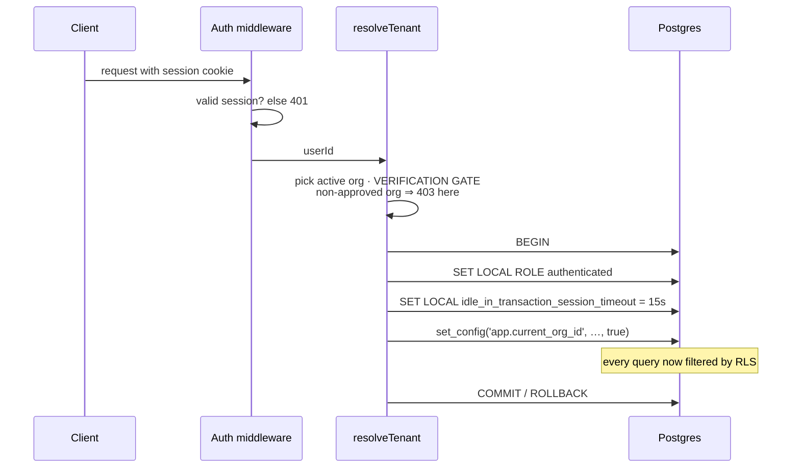
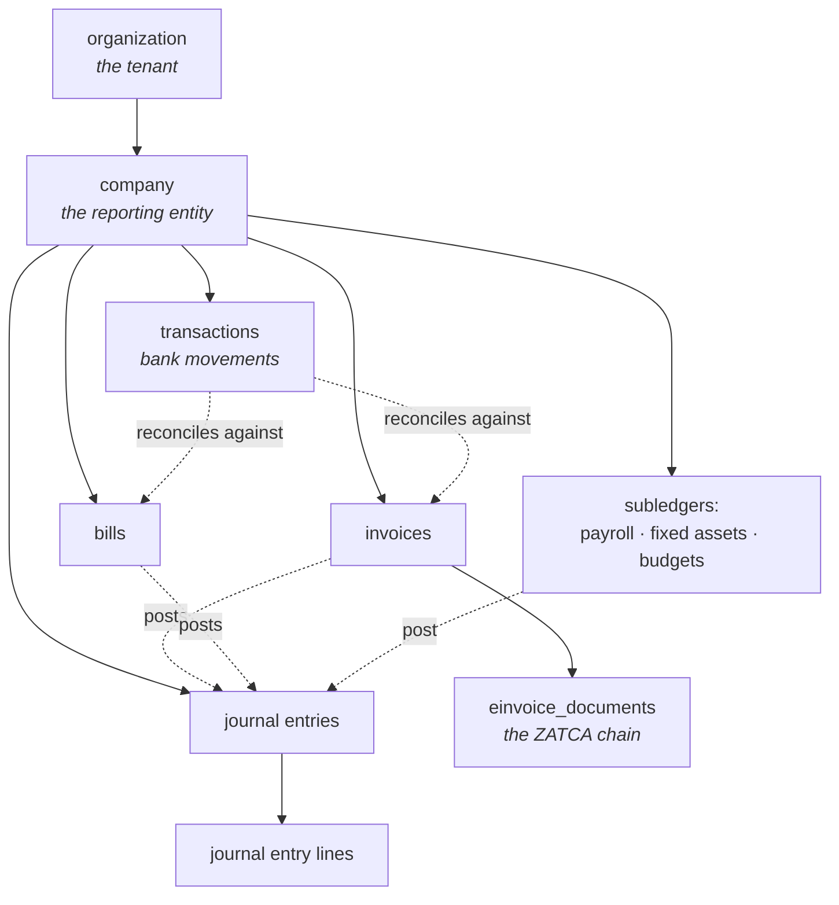
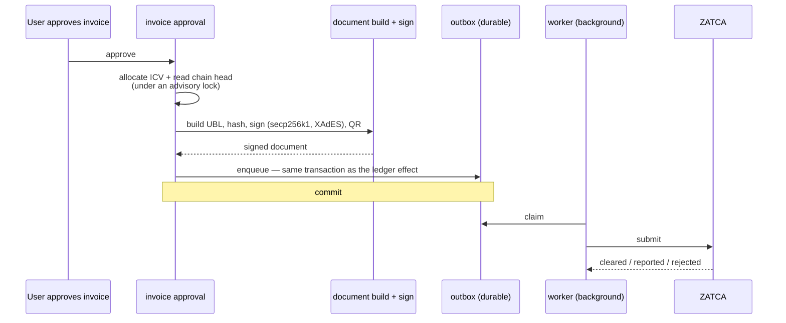
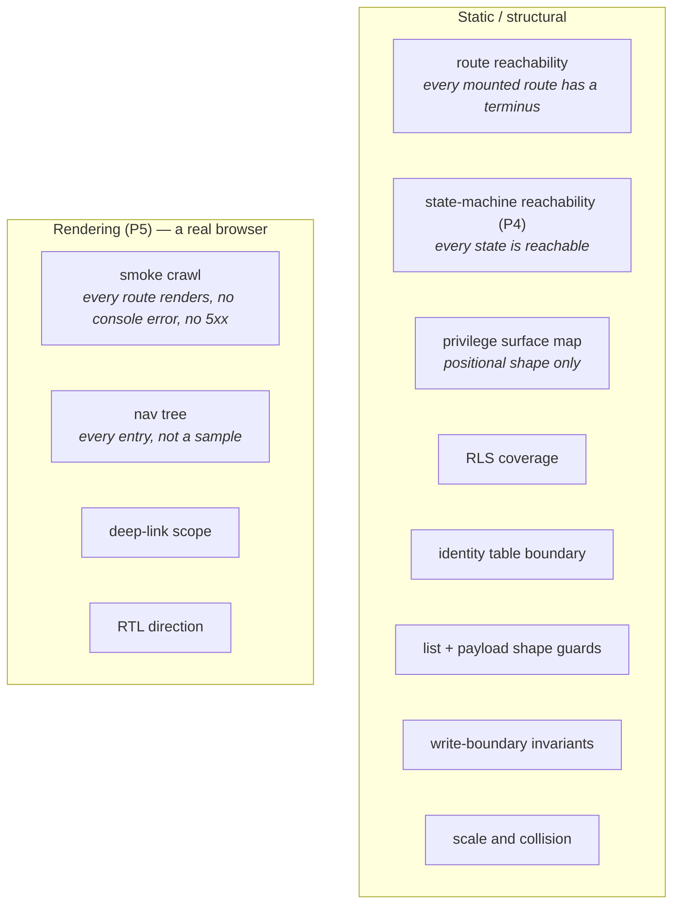

# Saudi Ledger Platform — High-Level Design

**Status (2026-08-31): describes the system as it exists on this date.**
**Current state authority: [`CLAUDE.md` §2](../CLAUDE.md).** This document
describes *shape* — what the parts are and why they are arranged this way. It
deliberately does not restate progress, because a second writer for "now"
drifts from the first. Where something is planned rather than built, it says
so in those words.

**No figures that age.** Test counts, entry counts and coverage percentages are
not quoted here; they are true for a week and wrong for a month. Where a number
matters, this points at the thing that produces it.

> **Who this is for.** Someone who has never seen the system: a joining
> developer, technical diligence, a prospective partner. It assumes no context
> and hides nothing material — including the parts that are unfinished, unproven
> or blocked, which are marked 🔴.

---

## 1. What the product is

An **AI-assisted accounting and finance platform for Saudi Arabia**, built for
small and medium businesses and their accountants, with the GCC as the later
market.

It began as a single-tenant bookkeeping application and was refactored into a
multi-tenant SaaS platform. The accounting core is real: invoices, bills,
journal entries, double-entry posting to a general ledger, period locks, VAT,
and Zakat scope all work today, and are the most heavily tested part of the
codebase.

Three things distinguish it from generic accounting software:

1. **ZATCA e-invoicing is native**, not an add-on. Saudi Arabia mandates
   structured, cryptographically signed e-invoices; the document pipeline,
   signing, QR generation and submission transport are built into the invoice
   approval path rather than bolted on afterwards (§5).
2. **Arabic is a first-class language**, not a translation layer. The UI is
   bilingual and right-to-left aware; documents carry Arabic fields.
3. **AI proposes, never posts.** Categorisation, receipt capture, findings and
   grounded answers are all suggestion surfaces. Nothing AI produces reaches the
   ledger without a human act (§6).

### What it is not

- **Not a payroll bureau or an ERP.** Payroll and fixed assets exist as
  subledgers that post into the GL, not as standalone products.
- **Not a tax filing agent.** It computes VAT and Zakat figures; it does not
  file returns. ZATCA e-invoicing is *invoice clearance and reporting*, which is
  a different obligation from filing a VAT return.
- 🔴 **Not a business that can take money yet.** There is no billing,
  subscription or plan gating anywhere in the codebase. This is tracked as the
  first item of the pre-production queue in `CLAUDE.md` §5.

---

## 2. Architecture

### 2.1 Monorepo

pnpm workspaces, three groups: `apps/*`, `packages/*`, `scripts`.

| Workspace | Package | What it is |
| --- | --- | --- |
| `apps/api` | `@workspace/api-server` | Express 5 backend, TypeScript ESM, bundled with esbuild |
| `apps/web` | `@workspace/bookkeeping` | React 19 + Vite frontend |
| `packages/db` | `@workspace/db` | Drizzle schema, the pg pools, tenant-transaction machinery, SQL migrations — the source of truth for the data model |
| `packages/api-spec` | — | `openapi.yaml` plus the orval config that generates from it |
| `packages/api-zod` | `@workspace/api-zod` | Generated Zod schemas and types |
| `packages/api-client-react` | — | Generated React Query client |
| `packages/config` | `@workspace/config` | Validated environment (`loadEnv`, fail-fast) |
| `packages/zatca-tlv` | — | TLV encoding for the ZATCA QR payload |

There is deliberately **no `packages/auth`**: authentication and RBAC live in
`apps/api/src/lib/` after several milestones of work there, and the empty
scaffold was deleted rather than left as an invitation.

The workspace pins `minimumReleaseAge: 1440` — a package version must have been
published for a day before pnpm will install it. That is a supply-chain
control, not a preference.

### 2.2 Layered backend

```
Route  →  Controller  →  Service  →  Repository  →  Postgres
```

- **Routes** are thin: validate, delegate. No business logic.
- **Controllers** orchestrate and shape responses. No database access.
- **Services** hold business logic.
- **Repositories** hold *all* Drizzle access, tenant-scoped.

One sanctioned exception: the **accounting core** —
`services/accounting/` (GL posting, period locks, ZATCA) and
`services/categorization/` — reaches the database directly. That is recorded as
a decision rather than tolerated as drift.

### 2.3 API contract: OpenAPI-first

`packages/api-spec/openapi.yaml` is the contract. The flow is: change the spec,
run codegen, then implement. Generated output under `src/generated/**` is never
hand-edited.

🔴 **One exception, deliberately hand-maintained:**
`packages/api-client-react/src/custom-fetch.ts` — orval's mutator, carrying
cookie credentials and the verification-gate error hook.

🔴 **A constraint in the spec binds nothing on its own.** These routes pass
`req.body` to services directly, so a declared `minItems` or `maxLength` is
documentation until a service re-states it. This was learned expensively: a
`minItems` constraint existed for quotations and purchase orders, was absent for
invoices, and an invoice with no lines was accepted and issued at zero value.
Read the contract as documentation; the enforcement is in the code.

### 2.4 Frontend

React 19 + Vite, TypeScript, Tailwind CSS v4, shadcn/ui primitives, **wouter**
for routing, **TanStack Query** for data fetching, a custom `LanguageContext`
for Arabic/English with RTL.

The navigation is **data, not JSX** (`apps/web/src/nav/tree.ts`). Every entry
carries a marker — `built`, `filter`, or `coming-soon` — and filter entries
carry the destination and status they apply. That shape exists so the browser
suite can walk every entry mechanically instead of sampling (§7).

🔴 **Coming Soon pages are real pages that name their blocker.** Roughly a third
of the navigation points at features that do not exist. Each resolves to a
placeholder stating specifically what it is waiting on — a contract, a
registration, an advisor's answer, an undesigned decision — and what the work
becomes the day that clears. *"Not built" invites someone to build it; "waiting
on a contract" tells them why they must not.*

### 2.5 Background work

An **in-process scheduler** (`apps/api/src/jobs/`), not a queue system. There is
no Redis and no external broker; rate limiting is in-memory per process.

Registered jobs include the e-invoice outbox worker, the archive sweep,
certificate renewal checks, document-capture promotion and purge, recurring
document generation, platform alarms, and scheduled findings. Some are
registered but gated off by configuration so that an operator can still trigger
them manually.

🔴 **Planned, not built:** a durable queue. The current design is honest about
being single-process; horizontal scaling would need one.

---

## 3. Multi-tenancy and the security model

This is the part of the system most worth understanding, and the part where the
most has been learned the hard way.

### 3.1 The core mechanism: RLS on a non-owner role

Every business table carries `organization_id NOT NULL` and a `tenant_isolation`
row-level-security policy keyed on the `app.current_org_id` GUC. Enforcement is
at runtime: each request runs inside a **transaction** on a **non-owner
Postgres role**, with the tenant GUCs set transaction-locally.



Three properties are worth naming:

- **The connection is acquired lazily.** A request that issues no query never
  takes one, so routes that touch no data cannot starve the pool.
- **The 15-second idle-in-transaction guardrail is deliberate.** It is why a
  synchronous call to an external API cannot live inside a request transaction —
  the reason the e-invoice outbox exists (§5).
- 🔴 **A connection error must not kill the process.** `node-postgres` emits
  `error` on a client whose connection dies; an unhandled `error` event is fatal
  in Node. Listeners are attached both to the pools *and to each checked-out
  client*, because the pool does not forward errors for clients in use. Pinned
  by an executable test that terminates a live backend and requires the process
  to survive.

`db` **refuses** a query issued outside a tenant transaction. It used to fall
back silently to the owner connection — RLS bypassed, no error. A deliberately
cross-tenant caller imports **`ownerDb`** and says so in the code.

### 3.2 The identity layer sits outside RLS, deliberately

`organizations`, `users` and `organization_memberships` are **not** RLS-scoped.
They cannot be: resolving which tenant a request belongs to has to happen before
a tenant exists to scope to.

The consequence is a rule with a guard behind it: **business-layer code must not
read those tables.** A forgotten filter there is a silent cross-tenant leak that
nothing catches. Only the identity layer — pre-`resolveTenant`, on the owner
connection, with explicit authorization — is a correct consumer.
`tests/identity-table-boundary.test.ts` enforces it by import analysis, and is
honest about its limit: raw SQL slips past.

### 3.3 Authorization

Explicit and scoped, never ambient:

- `requirePermission` for capability checks, answering refusals with a
  **structured code** rather than prose, so re-wording copy cannot break a
  client that keys on it.
- admin-of-*this*-org checks for organization administration.
- `requirePlatformOperator` for the platform surface.

🔴 **`users.role` is vestigial and must never gate access.** The
`organization_memberships` role governs.

🔴 **A refusal explains; it does not hide the control.** A hidden button teaches
nothing; a refusal naming the next step teaches the workflow. This was reversed
into the product deliberately.

### 3.4 The platform-operator boundary

Platform operators review and approve organization sign-ups. The boundary is
that **operators hold no tenant membership**, so `resolveTenant` blocks them from
every business route. `/operator` is a separate surface.

🔴 **G-1 — checked, and absent.** A hypothesised escalation was investigated:
that `assertOrgAdmin` might exempt platform operators, letting an operator add
themselves to a tenant as an admin. It **does not exist**. Operator status is
consulted in four places and none of them is an authorization path. That is now
pinned *behaviourally* by `tests/operator-tenant-boundary.test.ts` rather than
asserted in a comment — the specific escalation it rules out is an operator
joining a tenant and acting inside it.

🔴 **Two operator findings that were real, and are closed:**

- **F1 — cross-tenant account takeover (HIGH).** Any admin of any approved
  organization could graft a stranger's account into their own organization
  (adding a member required no consent, and user ids are sequential), then reset
  its password and log in — into every tenant that account could reach. Fixed by
  **confinement** (`lib/accountScope.ts`): an actor can cause an overlap with one
  INSERT, and cannot cause confinement at all. The lesson generalises: **a guard
  that tests a fact its own caller can create is not a boundary.**
- **F2 — operator job reach was inherited, not decided.** The operator job
  runner could reach every job in the scheduler registry rather than a declared
  set. Fixed by having the operator surface **declare its own reach**
  (`lib/operatorJobs.ts`), refused at both route and service, and audited.

Both are executable regression tests, verified by re-injecting the attack.

### 3.5 The privilege surface map, and what it does not cover

`tests/privilege-surface-map.test.ts` derives what each privilege reaches from
the **live router stack** and fails when that drifts.

🔴 **It would not have caught F1, and must never be cited as though it would.**
There are two composition shapes and they need different countermeasures:

| Shape | What it looks like | Countermeasure |
| --- | --- | --- |
| **Position** — a route on the wrong side of a guard | mechanical | the surface map |
| **Data flow** — one file writes the fact another guard trusts; both files are correct and the *edge* is the hole | human | enumerate what a privilege can WRITE, then grep every guard that READS that fact |

F1 was the second shape.

🔴 **Foreign keys run outside RLS.** Every plain FK between tenant-scoped tables
is a cross-tenant edge no policy guards, and a foreign-key violation versus
success is an existence oracle. When auditing isolation, enumerate the FKs, not
only the queries.

### 3.6 Other properties worth knowing

- **Auth is Express sessions** (`express-session` + `connect-pg-simple`,
  bcryptjs). Supabase is used as **Postgres only** — not Supabase Auth.
- The session store has its **own pool**, isolated from the request-transaction
  pool, so a slow request holding a tenant transaction cannot starve logins.
- **Owner-only tables REVOKE explicitly.** Supabase's base default privileges
  re-grant `TRUNCATE`/`REFERENCES`/`TRIGGER` on every `CREATE TABLE`, and
  **TRUNCATE bypasses RLS**. The defaults are narrowed and a guard test pins it.
- **Audit trail is append-only at the grants**, and has a reader UI.

---

## 4. The data model, conceptually

Not a table listing — `packages/db/src/schema/` is the source of truth. What
follows is the shape and the rules that are not visible from column names.



**Two levels of tenancy.** An `organization` is the tenant and the unit of RLS.
A `company` is the reporting entity inside it — its own document sequences, its
own fiscal calendar, its own period locks. Most business tables carry both.

**The invariants that are not obvious:**

- **Documents FILE; transactions RECONCILE.** The VAT return reads invoices and
  bills, line by line, credit-note-correct and box-structured. The
  transaction-derived figure is a *reconciliation view only*.
- **Amounts are stored positive; direction lives in `document_type`.** Every
  consumer applies an explicit sign function. A credit note reverses; a **debit
  note does not** — it posts like an invoice.
- 🔴 **A journal entry with `status = 'reversed'` is still IN the books.** The
  status marks that a cancelling mirror exists; it is not an eraser. Filtering
  aggregations to `posted` only double-negates every reversal. This was found
  live, moving real money in a development organization.
- **Transfers and settlements are excluded from income, expense, VAT, Zakat and
  budget aggregates** — the bank balance moved though nothing was earned or
  spent. Transfers *do* post to the GL (cash against a clearing or equity
  account) with no P&L, tax or budget line ever. Settlements never post; their
  cash effect belongs to the payment paths.
- **Nothing affects the books before approval.** Drafts and submitted records
  move zero in every report, and this is asserted per entity as a standard.
- **Period locks are company-scoped.** A correction to a closed period posts in
  the current open period — never re-dated into a closed one, and never silently
  skipped.
- **Derived, never stored:** *overdue* on invoices and bills, *expired* on
  quotations, and the conversion axis on quotations and purchase orders. Each is
  defined in exactly one place, in the repository, because a stored copy of a
  fact the dates already hold will drift from it.
- **Single currency (SAR) is enforced at the write boundary**, not assumed.

🔴 **The chart of accounts is seeded by a database trigger** that copies a
template table column by column. A migration touching either side must redefine
the trigger function, and a standing test compares the two column sets rather
than knowing any column's name — it has been verified to fail in both
directions.

---

## 5. ZATCA e-invoicing

Saudi Arabia's e-invoicing mandate (Fatoora) requires invoices to be generated
in a structured format, cryptographically signed, chained, and either **cleared**
(standard invoices, before issue) or **reported** (simplified invoices, after).



**Why the outbox exists, and it is not the timeout.** If the request transaction
rolled back *after* ZATCA accepted an invoice, the ledger would hold no record
of a document ZATCA considers issued — a permanently consumed counter value and
a gap in a legally required sequence that cannot be repaired. Committing the
queue row in the same transaction as the ledger effect makes that impossible.

**The chain needs two mechanisms**, and this is easy to get wrong:

1. **Allocation serialised by an advisory lock** covering both the counter read
   and the chain-head read.
2. **Ordering by counter, not by row id.** A unique constraint on
   `(company, counter)` is a backstop that structurally cannot see a fork.
   Out-of-order approvals fork the chain *sequentially* — this is not purely a
   concurrency problem.

🔴 **Two hash chains exist and must not be confused.** `invoices.invoice_hash` /
`previous_hash` are a homegrown tamper-evidence mechanism. The legally
meaningful chain lives on `einvoice_documents`, and the previous-invoice hash
comes from there only, read inside the sequence lock.

**Issuance fails closed for onboarded companies**, deliberately: if the document
cannot be built or signed, the approval rolls back. A key-management outage stops
invoicing rather than minting an unreachable invoice and a permanent gap.
Companies with no active credential are skipped silently and issue as before.

**The archive has no delete, by design** (the regulation forbids deletion).
Deletable staging is a separate interface. Archive filenames use the
*generation* timestamp, never clearance.

### 🔴 What is proven, and what is not

This distinction is the most important paragraph in this document for anyone
assessing readiness.

**Verified against the live ZATCA sandbox:** the certificate signing request and
the `secp256k1` curve, the XAdES signature properties and both digest encodings,
all nine QR tags, six compliance documents (standard and simplified × invoice /
credit note / debit note, plus zero-rated), and a path built from real Postgres
rows produced by the product's own write path.

🔴 **NOT verified — no invoice has ever been submitted to ZATCA, in any
environment.** The compliance pass covers document **construction**, which is an
onboarding gate. The production path has never been called. Also local-only: the
outbox transport (proven against a mock), the archive (local filesystem only),
renewal reminders (synthetic dates), and the enqueue path (a self-signed
certificate, not a real production credential).

**Sandbox traps, recorded because they mislead:** it accepts any one-time
password; a request identifier is a constant stub; the sandbox credential is a
shared canned certificate not bound to our key; and **a credential is issued
even when compliance documents fail** — so compliance results must be asserted
directly and never inferred from certificate issuance.

🔴 **Blocked on a registration, not on engineering.** Simulation and the
production pilot both require a registered Saudi company entity with an active
VAT registration and government credentials. That entity does not exist. No
rework is expected when it arrives, because the sandbox exercises the same API
surface.

**Trust order for sources: live API > SDK > PDF > secondary.** A green SDK
differential is not evidence of compliance — one passed byte-for-byte while the
live API rejected the QR.

---

## 6. The AI layer

### 6.1 The governing rules

1. **AI proposes; it never posts.** The general ledger is written only through
   the established posting path. AI output is drafts and suggestions a human
   approves.
2. **Nothing is auto-applied**, however exact the match. Suggestions may be
   pre-selected; the human clicks.
3. **An act about a document is not an act about a pattern.** Consenting to a
   recurring rule in January is not consenting to what it produces in November —
   which is why recurring generation produces drafts only.
4. **Answers are grounded and show their work**, and the layer states *where* a
   change came from, never *why*.

### 6.2 What exists

Categorisation assistance, a receipt-capture pipeline (QR decode, OCR fallback,
supplier matching), a deterministic findings engine with model-phrased
explanations that are mechanically verified before being shown, scheduled
findings runs, and grounded question answering over the tenant's own records.

Every model call goes through a **metered wrapper** that records usage beside
the call — including failures, because a provider outage that vanished from the
meter would make the usage curve lie.

### 6.3 🔴 The layer is DARK by construction

The boot boundary **refuses to send tenant data to the model provider** until a
Groq Enterprise agreement is signed. The free tier routes globally, and
development is not treated as an exception to that.

This is not a feature flag someone can flip by accident: the code is built and
tested, and the data boundary is the gate. In the navigation, the AI assistant
resolves to a placeholder that names the contract it waits on.

🔴 **One design item must be resolved before the layer is enabled.** The
scheduled findings run currently calls the model provider **inside an open
tenant transaction**. That is the pattern the e-invoice outbox exists to prevent
for ZATCA, repeated for a different external API: the 15-second guardrail fires
and terminates the connection. It is latent only because the layer is dark.
Recorded in `CLAUDE.md` §5.

---

## 7. The guard set

Guards here are tests that assert a *structural property* rather than a
behaviour, because this project's expensive defects have almost all been
structural.



**Why the rendering layer exists.** Six read-only audits found none of four
defects that one pass with a browser found in seconds. The service tests build
their requests the way the server expects, so a client that builds one
differently is invisible to them *by construction*. A correct backend with no
working surface is structurally outside what any of them can see.

**Four properties of the browser suite worth knowing:**

- **Retries are zero, deliberately.** A suite people learn to re-run reports
  coverage it does not have.
- **The navigation check walks every entry** — a built entry points at a real
  route, a filter entry's destination *reflects* the filter, a coming-soon entry
  names a blocker. That is possible because the tree is data.
- 🔴 **Some routes must render a row.** An empty state satisfies every other
  assertion — `<main>` exists, the body has content, no console error — so a
  page can be fully "covered" with none of its row-rendering code executed. The
  fixture seeds breadth on purpose and the suite asserts on it.
- **A check is its assertion *and* the moment it is taken.** The RTL first-paint
  test waits only for the navigation commit, because any later wait lets React
  mount and repair the thing under test.

🔴 **The limit, stated because it is a property of the defect and not of the
tooling:** *a vacuous pass is indistinguishable from a real pass in every report
the suite produces.* The suite cannot tell "this assertion held" from "this
assertion was never reached". Coverage instrumentation would narrow that and not
close it, because a line can execute against data too uniform to expose a
collision. This is the argument for seeding breadth deliberately rather than
hoping coverage finds it.

**Also enforced mechanically:** the operating file's size budget, the
organization-seed trigger's column symmetry, demo-mode reset safety, and
single-currency at the write boundary.

For what the suite currently reports, run it — see §9. This document quotes no
count.

---

## 8. External dependencies and provider seams

Every external capability sits behind an interface with a resolver, so the
choice of vendor is a deployment decision rather than a rewrite.

| Seam | What it abstracts | Status |
| --- | --- | --- |
| `EInvoiceProvider` | onboard · renew certificate · build document · submit | Implemented in-house; **all four methods route through the seam** — one of two mandatory hedges behind the build-direct decision |
| `KeyWrapper` | credential encryption | 🔴 Key-management deployment unverified |
| `ArchiveStore` | e-invoice archival, **no delete by design** | Local filesystem only; cloud is permitted — the binding constraint is a direct audit link |
| `Mailer` | transactional email | Code complete; 🔴 **no provider wired** |
| `Alerter` | operational alarms | Code complete; 🔴 **no destination wired** |
| `MalwareScanner` | uploaded-file scanning | 🔴 Header-only magic-byte sniff until a scanner sidecar is deployed |
| `AiProvider` | chat and vision | Groq; 🔴 **dark until the agreement is signed** |

🔴 **A stub is the part that needed testing.** At any of these interfaces, a
method that cannot do the thing must **throw**, never return: a no-op reporting
success is a false statement the caller builds on.

🔴 **A dependency that accepts your input has not promised to honour it.** A
small-ICU Node accepts an Islamic calendar identifier and returns Gregorian
dates. Where a dependency can silently substitute behaviour, an externally
checkable fact is probed at boot. "It did not throw" is not evidence.

**Runtime dependencies:** PostgreSQL (via Supabase, Postgres only). **No Redis,
no message broker, no object store in use.**

---

## 9. Deployment posture — honestly

🔴 **Nothing is deployed.** There is no hosted environment, no hosted Supabase
project, and no production or staging URL. The codebase is demo-ready; a demo
has not been stood up. Everything described in this document runs locally and
in continuous integration.

### Items that cannot be closed from code

These are not engineering tasks. They are decisions or acts that must happen in
a real environment, and each is tracked in `CLAUDE.md` §5:

- **Hosting and residency**, including the region and key-management deployment.
- **The AI provider agreement** — required before any tenant data reaches the
  model provider.
- **A mail provider and a verified sending domain**, and an alert destination
  pointed somewhere real. *An unwired alarm is the thing the alerting work
  exists to prevent.*
- **The real proxy count** in front of the application, because a wrong number
  makes the rate limiter spoofable in either direction.
- **A malware scanner sidecar.**
- **The Saudi entity registration**, which gates ZATCA simulation and the
  production pilot, and open-banking connectivity.

### Continuous integration

GitHub Actions runs typecheck, the test suite, a build, and the browser suite
against a real Postgres service container with migrations applied.

🔴 **The browser job was landed as a non-required check on purpose**, until it
had been green across real pull requests — a new suite's first failures are
usually its own harness, and blocking merges on that teaches people to ignore
it.

**A merge gate must assert every check's *conclusion*, not that checks
completed.** A pull request was once merged with a red check because a polling
loop waited for `status: completed` and never looked at `conclusion`.

---

## 10. Where to go next

| You want | Read |
| --- | --- |
| Current status, the open queue, the standing rules | [`CLAUDE.md`](../CLAUDE.md) |
| Layering, tenancy, RBAC, "add a new domain" | [`development-guide.md`](development-guide.md) |
| Running it locally | [`local-setup.md`](local-setup.md) |
| ZATCA specifics and what is proven where | [`zatca/`](zatca/) |
| Why a decision was made the way it was | [`history/findings-and-lessons.md`](history/findings-and-lessons.md) |
| The navigation decision and its markers | [`product/nav-tree-reconciliation.md`](product/nav-tree-reconciliation.md) |
| Test-suite ordering and timing fragilities | [`test-suite-notes.md`](test-suite-notes.md) |

---

## Appendix — technology summary

| Layer | Technology |
| --- | --- |
| Monorepo | pnpm workspaces |
| Backend | Express 5, TypeScript (ESM), esbuild bundle |
| Frontend | React 19, Vite, Tailwind CSS v4, shadcn/ui |
| Routing (FE) | wouter |
| Data fetching | TanStack Query |
| ORM | Drizzle |
| Database | PostgreSQL (Supabase — Postgres only, **not** Supabase Auth) |
| Cache / queue | **None** — in-process scheduler, in-memory rate limiting |
| Auth | `express-session` + `connect-pg-simple`, bcryptjs |
| API contract | OpenAPI-first, orval codegen |
| Validation | Zod (generated) |
| i18n | Custom `LanguageContext`, Arabic/English, RTL-aware |
| Logging | pino / pino-http |
| Browser tests | Playwright |
